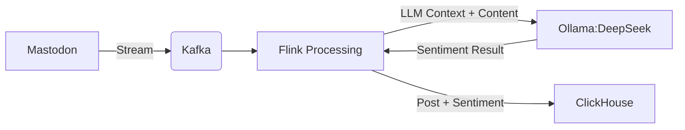

# Real-time Data Pipeline Architecture

This project demonstrates a modern real-time data pipeline implementation with two core components:

1. **Change Data Capture (CDC) Ingestion**: Replicating changes from an OLTP database to an OLAP system.
2. **Realtime Analytics**: Processing streaming data with Apache Flink.

## Features
- **Change Data Capture (CDC) Pipeline**: Continuous sync from PostgreSQL to ClickHouse
- **Real-time Sentiment Analysis**: Stream processing of Mastodon social media data using Flink
- **AI Integration**: DeepSeek LLM for natural language processing
- **Observability**: Kafka monitoring with Kowl

## Prerequisites
- Docker & Docker Compose
- `curl` (for API requests)

---

## 1. CDC Ingestion: PostgreSQL → Kafka → ClickHouse

### Architecture


### Deployment Steps

#### Step 1: Start Docker Services
Start the required services (Zookeeper, Kafka, PostgreSQL, ClickHouse, and Kowl for Kafka monitoring):
   ```bash
   docker-compose up -d
   ```

#### Step 2: Add Kafka Connect Source for PostgreSQL CDC
   ```bash
   curl -X POST -H "Content-Type: application/json" \
     localhost:8083/connectors -d @postgres-cdc.json
   ```

#### Step 3: Add Kafka Connect Sink for ClickHouse
   ```bash
   curl -X POST -H "Content-Type: application/json" \
     localhost:8083/connectors -d @clickhouse-sinker-cdc.json
   ```

#### Validation
- **Verify Data Flow:**
  1. Check Kafka topics using Kowl UI: `http://localhost:8080`
  2. Compare records in PostgreSQL and ClickHouse

- **PostgreSQL Operations:**
   ```sql
   INSERT INTO demo_table1 VALUES (4, 'sample');
   UPDATE demo_table2 SET value = 'updated' WHERE id = 1;
   ```

---

## 2. Realtime Analytics - Mastodon Sentiment Analysis with Flink

### Architecture


### 2.1 Mastodon Producer
#### Step 1: Build the Docker Image
```sh
cd mastodon_producer
docker build -t pyflink:1.14.0 .
```

#### Step 2: Run Docker Containers
```sh
docker-compose up -d
```

#### Step 3: Start the Mastodon Listener inside container
```sh
python code/mastodon_listener.py \
    --baseURL https://mastodon.social/public/local \
    --public --enableKafka --quiet --watchdog 10
```

### 2.2 Ollama with DeepSeek

#### Step 1: Run the Docker Container
```sh
cd ollama
docker-compose up -d
```

#### Step 2: Pull the DeepSeek Model
Using the lightweight version (`deepseek-r1:1.5b`):
```sh
curl -X POST -H "Content-Type: application/json" \
    localhost:11434/api/pull -d @pull_model.json
```

#### Step 3: Test the DeepSeek Model
```sh
curl -X POST -H "Content-Type: application/json" \
    localhost:11434/api/generate -d @test_model.json
```

### 2.3 ClickHouse Table for Sentiment Analysis Results

Create a table to store sentiment analysis results:
```sql
CREATE TABLE IF NOT EXISTS mastodon_sentiment (
    m_id Nullable(UInt64),
    created_at Nullable(String),
    username Nullable(String),
    bot Nullable(Boolean),
    mastodon_text Nullable(String),
    sentiment Nullable(String)
) ENGINE = MergeTree()
ORDER BY tuple();
```

### 2.4 Flink - Stream Processing

#### Step 1: Build the Docker Image
```sh
cd flink
docker build -t pyflink:1.14.0 .
```

#### Step 2: Run Flink in Docker
```sh
docker-compose up -d
```

#### Step 3: Start the Flink Sentiment Analysis Job
```sh
python flink_sentiment.py
```

### 2.5 Add Kafka Connect Sink for ClickHouse
```sh
curl -X POST -H "Content-Type: application/json" \
    localhost:8083/connectors -d @clickhouse-sinker-flink.json
```

---

### Future Improvements
1. Monitoring
- Implement monitoring and alerting for easier debugging.
- Could use Prometheus + Grafana for real-time metrics and visualization.
- Set up alerting rules to detect failures in CDC ingestion and Flink processing.

2. CDC Ingestion
- Encode CDC data using Protobuf for efficient serialization.
- Add a schema registry to manage and validate data schemas dynamically.
- Optimize Kafka topic partitions to ensure better scalability and load balancing.

3. LLM
- Use a larger model, such as `deepseek-r1:7b`, for improved accuracy.
- Deploy using vLLM on a GPU-enabled environment for faster inference.
- Fine-tune sentiment analysis models on domain-specific datasets to improve classification precision.

---

## Monitoring & Troubleshooting

**Key Endpoints:**
- Kowl (Kafka UI): `http://localhost:8080`
- Flink Dashboard: `http://localhost:8081`
- ClickHouse: `http://localhost:8123`

---
## Contribution

This project is a work in progress. Contributions and improvements are welcome!
